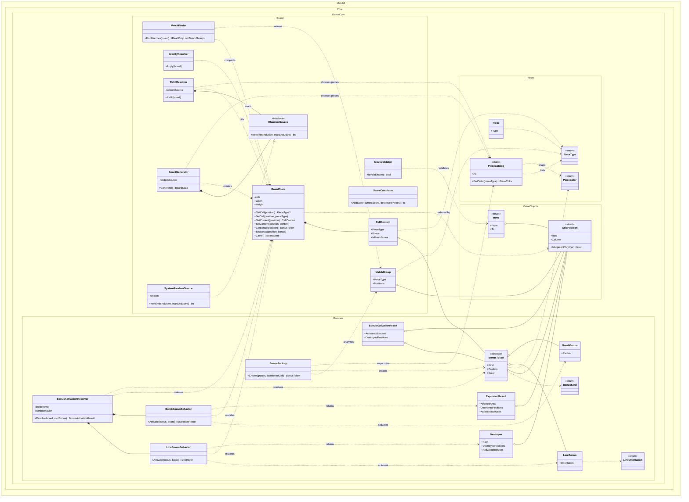

# Game Core Class Diagram

This diagram focuses on the pure gameplay simulation in `Match3.Core.GameCore`: board state, value objects, piece catalog, random source, matching, refill, gravity, and bonuses.

