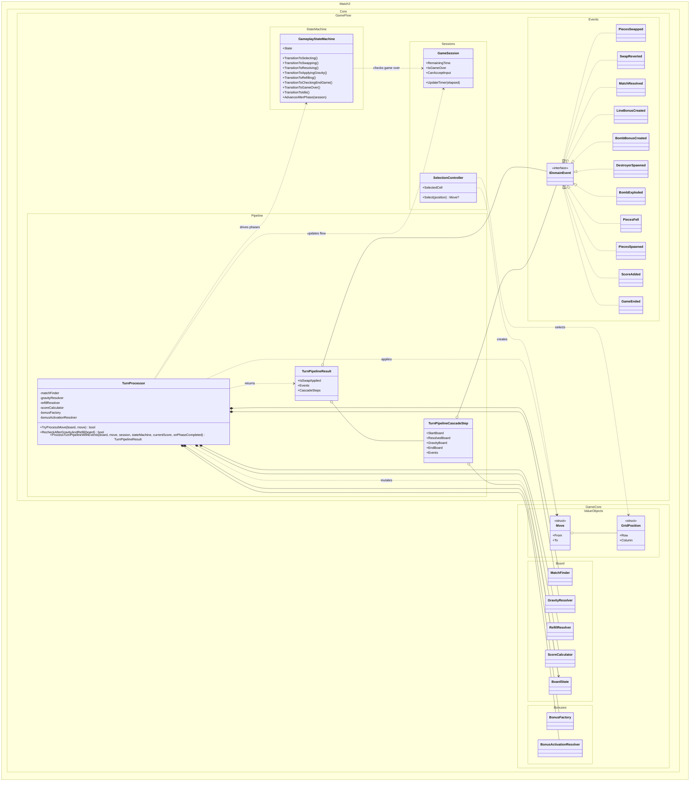

# Game Flow Class Diagram

This diagram focuses on the orchestration layer in `Match3.Core.GameFlow`: selection, state machine, turn pipeline, and domain events.

```mermaid
classDiagram
direction LR

namespace Match3.Core.GameFlow.Sessions {
    class GameSession {
        +RemainingTime
        +IsGameOver
        +CanAcceptInput
        +UpdateTimer(elapsed)
    }

    class SelectionController {
        +SelectedCell
        +Select(position) Move?
    }
}

namespace Match3.Core.GameFlow.StateMachine {
    class GameplayStateMachine {
        +State
        +TransitionToSelecting()
        +TransitionToSwapping()
        +TransitionToResolving()
        +TransitionToApplyingGravity()
        +TransitionToRefilling()
        +TransitionToCheckingEndGame()
        +TransitionToGameOver()
        +TransitionToIdle()
        +AdvanceAfterPhase(session)
    }
}

namespace Match3.Core.GameFlow.Pipeline {
    class TurnProcessor {
        -matchFinder
        -gravityResolver
        -refillResolver
        -scoreCalculator
        -bonusFactory
        -bonusActivationResolver
        +TryProcessMove(board, move) bool
        +RecheckAfterGravityAndRefill(board) bool
        +ProcessTurnPipelineWithEvents(board, move, session, stateMachine, currentScore, onPhaseCompleted) TurnPipelineResult
    }

    class TurnPipelineResult {
        +IsSwapApplied
        +Events
        +CascadeSteps
    }

    class TurnPipelineCascadeStep {
        +StartBoard
        +ResolvedBoard
        +GravityBoard
        +EndBoard
        +Events
    }
}

namespace Match3.Core.GameFlow.Events {
    class IDomainEvent {
        <<interface>>
    }

    class PiecesSwapped
    class SwapReverted
    class MatchResolved
    class LineBonusCreated
    class BombBonusCreated
    class DestroyerSpawned
    class BombExploded
    class PiecesFell
    class PiecesSpawned
    class ScoreAdded
    class GameEnded
}

namespace Match3.Core.GameCore.Board {
    class BoardState
    class MatchFinder
    class GravityResolver
    class RefillResolver
    class ScoreCalculator
}

namespace Match3.Core.GameCore.Bonuses {
    class BonusFactory
    class BonusActivationResolver
}

namespace Match3.Core.GameCore.ValueObjects {
    class GridPosition {
        <<struct>>
        +Row
        +Column
    }

    class Move {
        <<struct>>
        +From
        +To
    }
}

SelectionController ..> GridPosition : selects
SelectionController ..> Move : creates
GameplayStateMachine ..> GameSession : checks game over
TurnProcessor *-- MatchFinder
TurnProcessor *-- GravityResolver
TurnProcessor *-- RefillResolver
TurnProcessor *-- ScoreCalculator
TurnProcessor *-- BonusFactory
TurnProcessor *-- BonusActivationResolver
TurnProcessor ..> BoardState : mutates
TurnProcessor ..> Move : applies
TurnProcessor ..> GameSession : updates flow
TurnProcessor ..> GameplayStateMachine : drives phases
TurnProcessor ..> TurnPipelineResult : returns
TurnPipelineResult o-- IDomainEvent
TurnPipelineResult o-- TurnPipelineCascadeStep
TurnPipelineCascadeStep o-- BoardState
TurnPipelineCascadeStep o-- IDomainEvent
IDomainEvent <|.. PiecesSwapped
IDomainEvent <|.. SwapReverted
IDomainEvent <|.. MatchResolved
IDomainEvent <|.. LineBonusCreated
IDomainEvent <|.. BombBonusCreated
IDomainEvent <|.. DestroyerSpawned
IDomainEvent <|.. BombExploded
IDomainEvent <|.. PiecesFell
IDomainEvent <|.. PiecesSpawned
IDomainEvent <|.. ScoreAdded
IDomainEvent <|.. GameEnded
Move o-- GridPosition
```
