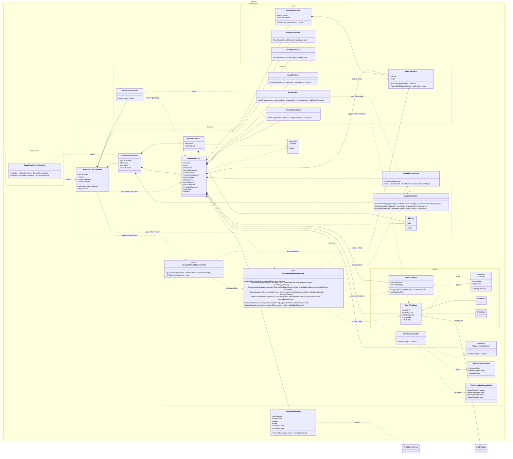

# Presentation Class Diagram

This diagram focuses on the `Match3.Presentation` layer: screen flow, rendering, input, and animation runtime.

```mermaid
classDiagram
direction LR

namespace Match3.Presentation.Composition {
    class GameFlowCompositionRoot {
        +CreateScreenFlowController() ScreenFlowController
        +CreateScreenHost(flowController) IGameScreenHost
    }
}

namespace Match3.Presentation.Screens {
    class IScreen {
        <<interface>>
        +Name
    }

    class PresentationScreenHost {
        -flowController
        -renderer
        -mouseInputRouter
        -touchInputRouter
        +Update(elapsed, inputState)
        +Draw(canvas)
    }

    class ScreenFlowController {
        -layoutCalculator
        +MainMenu
        +Gameplay
        +CurrentScreen
    }

    class MainMenuScreen {
        +PlayButton
        +PlayRequested
    }

    class GameplayScreen {
        +Presenter
        +Board
        +VisualBoard
        +BoardInputHandler
        +AnimationPlayer
        +TurnAnimationBuilder
        +BoardRenderer
        +HudRenderer
        +BoardTransform
        +BoardViewState
        +PieceNodeRenderer
        +VisualState
        +OkButton
    }
}

namespace Match3.Presentation {
    class GameplayPresenter {
        -turnProcessor
        -stateMachine
        -session
        +Score
        +RemainingTime
        +CanAcceptInput
        +ProcessMove(board, move) TurnPipelineResult
    }

    class GameplayVisualState {
        +Update(deltaSeconds)
        +BuildPieces(snapshot, selectedCell, viewState, animationPlayer)
    }
}

namespace Match3.Presentation.Input {
    class BoardInputHandler {
        -boardTransform
        -selectionController
        +HandleClick(worldPosition) Move?
    }

    class MouseInputRouter {
        +ShouldHandleBoardSelection(inputState) bool
    }

    class TouchInputRouter {
        +ShouldHandleBoardSelection(inputState) bool
    }
}

namespace Match3.Presentation.Rendering {
    class SpriteBatchRenderer {
        +Draw(canvas, screen)
    }

    class BoardRenderer {
        +BuildSnapshot(board, transform) BoardRenderSnapshot
    }

    class PieceNodeRenderer {
        +BuildSnapshot(snapshot, viewState) BoardRenderSnapshot
    }

    class HudRenderer {
        +BuildSnapshot(score, remainingTime, viewportWidth, viewportHeight) HudRenderSnapshot
    }

    class BoardTransform {
        +CellSize
        +Origin
        +GridToWorld(gridPosition) Vector2
        +TryWorldToGrid(worldPosition, gridPosition) bool
    }
}

namespace Match3.Presentation.UI {
    class LayoutCalculator {
        +CalculateGameplayLayout(viewportWidth, viewportHeight, rows, columns) GameplayLayout
        +CalculateMainMenuLayout(viewportWidth, viewportHeight) MenuLayout
        +CalculateGameOverLayout(viewportWidth, viewportHeight) MenuLayout
    }

    class UiButton {
        +Label
        +Click()
    }
}

namespace Match3.Presentation.Animation {
    class ITurnAnimationBuilder {
        <<interface>>
        +Build(context) IAnimation
    }

    class TurnAnimationBuilder {
        +Build(context) IAnimation
    }

    class TurnAnimationContext {
        +IsSwapApplied
        +QueueSwapAnimation
        +CascadeSteps
    }

    class TurnAnimationCascadeStep {
        +QueueResolveAnimation
        +QueueGravityAnimation
        +QueueSpawnAnimation
        +QueueSettleAnimation
    }

    class GameplayAnimationRuntime {
        <<static>>
        +QueueSwap(viewState, animationPlayer, move, rollback)
        +QueueMatchPop(viewState, animationPlayer, beforeSnapshot, afterSnapshot, events, initialDelaySeconds)
        +QueueGravity(viewState, animationPlayer, beforeSnapshot, afterSnapshot, initialDelaySeconds, excludedTargets, visualState)
        +QueueSpawn(viewState, animationPlayer, beforeSnapshot, afterSnapshot, cellSize, initialDelaySeconds, excludedTargets)
        +QueueCreatedBonuses(viewState, animationPlayer, afterSnapshot, cellSize, initialDelaySeconds, createdBonusOrigins)
        +QueueDestroyer(viewState, animationPlayer, origin, path, transform, initialDelaySeconds)
        +QueueExplosion(viewState, animationPlayer, area, transform, initialDelaySeconds)
    }

    class GameplayVisualEffectsTimeline {
        <<static>>
        +QueueEvents(viewState, animationPlayer, events, transform)
        +GetTotalDuration(events) float
    }
}

namespace Match3.Presentation.Animation.Engine {
    class IAnimation {
        <<interface>>
        +Update(deltaTime)
        +IsCompleted
        +BlocksInput
    }

    class AnimationPlayer {
        -activeAnimations
        -reservedBindings
        +Play(animation, conflictPolicy) AnimationHandle
        +Update(deltaTime)
    }

    class BoardViewState {
        -nodesById
        -nodeIdsByCell
        -effectNodesById
        +PieceNodes
        +EffectNodes
    }

    class PieceNode
    class EffectNode
}

GameFlowCompositionRoot ..> ScreenFlowController : creates
GameFlowCompositionRoot ..> PresentationScreenHost : creates
PresentationScreenHost *-- ScreenFlowController
PresentationScreenHost *-- SpriteBatchRenderer
PresentationScreenHost *-- MouseInputRouter
PresentationScreenHost *-- TouchInputRouter
ScreenFlowController *-- LayoutCalculator
ScreenFlowController *-- MainMenuScreen
ScreenFlowController *-- GameplayScreen
MainMenuScreen ..|> IScreen
GameplayScreen ..|> IScreen
MainMenuScreen *-- UiButton
GameplayScreen *-- GameplayPresenter
GameplayScreen *-- BoardInputHandler
GameplayScreen *-- AnimationPlayer
GameplayScreen *-- ITurnAnimationBuilder
GameplayScreen *-- BoardRenderer
GameplayScreen *-- HudRenderer
GameplayScreen *-- BoardTransform
GameplayScreen *-- BoardViewState
GameplayScreen *-- PieceNodeRenderer
GameplayScreen *-- GameplayVisualState
GameplayScreen *-- UiButton
GameplayPresenter ..> TurnPipelineResult : returns
BoardInputHandler *-- BoardTransform
SpriteBatchRenderer ..> IScreen : draws
SpriteBatchRenderer ..> GameplayScreen : renders gameplay
BoardRenderer ..> BoardTransform : projects board
PieceNodeRenderer ..> BoardViewState : applies node transforms
HudRenderer ..> LayoutCalculator : uses safe bounds
TurnAnimationBuilder ..|> ITurnAnimationBuilder
TurnAnimationBuilder ..> TurnAnimationContext : reads
TurnAnimationBuilder ..> TurnAnimationCascadeStep : sequences
TurnAnimationBuilder ..> IAnimation : builds
AnimationPlayer o-- IAnimation : plays
BoardViewState o-- PieceNode
BoardViewState o-- EffectNode
BoardViewState o-- GridPosition : maps by cell
GameplayAnimationRuntime ..> BoardViewState : mutates nodes
GameplayAnimationRuntime ..> AnimationPlayer : queues animations
GameplayAnimationRuntime ..> BoardTransform : projects effects
GameplayAnimationRuntime ..> GameplayVisualState : syncs selection
GameplayVisualEffectsTimeline ..> GameplayAnimationRuntime : schedules effects
GameplayVisualEffectsTimeline ..> BoardTransform : uses coordinates
PresentationScreenHost ..> GameplayAnimationRuntime : queues turn visuals
PresentationScreenHost ..> GameplayVisualEffectsTimeline : queues event effects
PresentationScreenHost ..> GameplayScreen : orchestrates interaction
```
