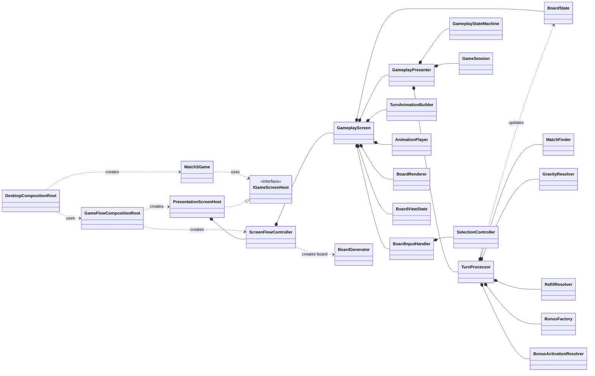

# Simplified Project Class Diagram

This is a compact diagram that shows only the main project-level runtime dependencies.

```mermaid
classDiagram
direction LR

class DesktopCompositionRoot
class Match3Game
class IGameScreenHost {
    <<interface>>
}
class GameFlowCompositionRoot
class PresentationScreenHost
class ScreenFlowController
class GameplayScreen
class GameplayPresenter
class BoardInputHandler
class TurnAnimationBuilder
class AnimationPlayer
class BoardRenderer
class BoardViewState
class TurnProcessor
class GameplayStateMachine
class GameSession
class SelectionController
class BoardState
class BoardGenerator
class MatchFinder
class GravityResolver
class RefillResolver
class BonusFactory
class BonusActivationResolver

DesktopCompositionRoot ..> Match3Game : creates
DesktopCompositionRoot ..> GameFlowCompositionRoot : uses
Match3Game ..> IGameScreenHost : uses
GameFlowCompositionRoot ..> PresentationScreenHost : creates
GameFlowCompositionRoot ..> ScreenFlowController : creates
PresentationScreenHost ..|> IGameScreenHost
PresentationScreenHost *-- ScreenFlowController
ScreenFlowController *-- GameplayScreen
ScreenFlowController ..> BoardGenerator : creates board
GameplayScreen *-- GameplayPresenter
GameplayScreen *-- BoardInputHandler
GameplayScreen *-- TurnAnimationBuilder
GameplayScreen *-- AnimationPlayer
GameplayScreen *-- BoardRenderer
GameplayScreen *-- BoardViewState
GameplayScreen *-- BoardState
GameplayPresenter *-- TurnProcessor
GameplayPresenter *-- GameplayStateMachine
GameplayPresenter *-- GameSession
BoardInputHandler *-- SelectionController
TurnProcessor ..> BoardState : updates
TurnProcessor *-- MatchFinder
TurnProcessor *-- GravityResolver
TurnProcessor *-- RefillResolver
TurnProcessor *-- BonusFactory
TurnProcessor *-- BonusActivationResolver
```
