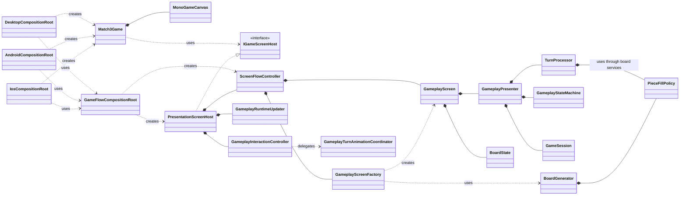

# Simplified Project Class Diagram

This is a compact diagram that shows the current top-level runtime dependencies after the architecture refactor.

```mermaid
classDiagram
direction LR

class DesktopCompositionRoot
class AndroidCompositionRoot
class IosCompositionRoot
class Match3Game
class MonoGameCanvas
class IGameScreenHost {
    <<interface>>
}
class GameFlowCompositionRoot
class PresentationScreenHost
class ScreenFlowController
class GameplayScreenFactory
class GameplayRuntimeUpdater
class GameplayInteractionController
class GameplayTurnAnimationCoordinator
class GameplayScreen
class GameplayPresenter
class TurnProcessor
class GameplayStateMachine
class GameSession
class BoardState
class BoardGenerator
class PieceFillPolicy

DesktopCompositionRoot ..> Match3Game : creates
AndroidCompositionRoot ..> Match3Game : creates
IosCompositionRoot ..> Match3Game : creates
DesktopCompositionRoot ..> GameFlowCompositionRoot : uses
AndroidCompositionRoot ..> GameFlowCompositionRoot : uses
IosCompositionRoot ..> GameFlowCompositionRoot : uses
Match3Game *-- MonoGameCanvas
Match3Game ..> IGameScreenHost : uses
GameFlowCompositionRoot ..> PresentationScreenHost : creates
GameFlowCompositionRoot ..> ScreenFlowController : creates
PresentationScreenHost ..|> IGameScreenHost
PresentationScreenHost *-- ScreenFlowController
PresentationScreenHost *-- GameplayRuntimeUpdater
PresentationScreenHost *-- GameplayInteractionController
ScreenFlowController *-- GameplayScreenFactory
ScreenFlowController *-- GameplayScreen
GameplayScreenFactory ..> BoardGenerator : uses
GameplayScreenFactory ..> GameplayScreen : creates
GameplayInteractionController ..> GameplayTurnAnimationCoordinator : delegates
GameplayScreen *-- GameplayPresenter
GameplayScreen *-- BoardState
GameplayPresenter *-- TurnProcessor
GameplayPresenter *-- GameplayStateMachine
GameplayPresenter *-- GameSession
TurnProcessor *-- PieceFillPolicy : uses through board services
BoardGenerator *-- PieceFillPolicy
```
