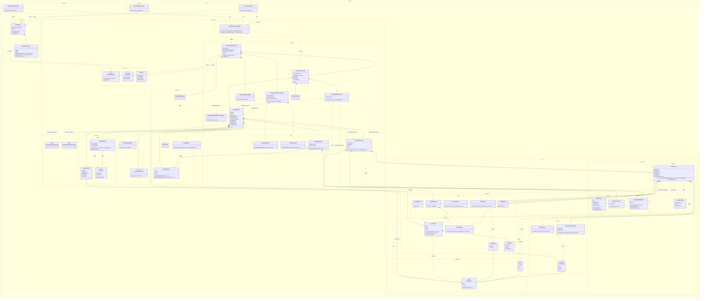

# Project Class Diagram

This diagram captures the current runtime split between shared platform hosting, presentation orchestration, and gameplay core.

```mermaid
classDiagram
direction LR

namespace Match3.DesktopGL {
    class DesktopCompositionRoot {
        +CreateGame() Match3Game
    }
}

namespace Match3.Android {
    class AndroidCompositionRoot {
        +CreateGame() Match3Game
    }
}

namespace Match3.iOS {
    class IosCompositionRoot {
        +CreateGame() Match3Game
    }
}

namespace Match3.Platform.Hosting {
    class Match3Game {
        -graphicsDeviceManager
        -canvas
        +Update(gameTime)
        +Draw(gameTime)
    }

    class MonoGameCanvas {
        +Begin()
        +End()
        +DrawFilledRectangle(x, y, width, height, tint)
        +DrawShape(shape, x, y, width, height, tint)
        +DrawText(text, x, y, tint)
    }
}

namespace Match3.Presentation.Runtime {
    class IGameScreenHost {
        <<interface>>
        +Update(elapsed, inputState)
        +Draw(canvas)
    }

    class IGameCanvas {
        <<interface>>
        +ViewportWidth
        +ViewportHeight
    }

    class InputState {
        +PointerPosition
        +IsPrimaryClick
        +ViewportWidth
        +ViewportHeight
    }
}

namespace Match3.Presentation.Composition {
    class GameFlowCompositionRoot {
        +CreateScreenFlowController() ScreenFlowController
        +CreateScreenHost(flowController) IGameScreenHost
    }
}

namespace Match3.Presentation.Screens {
    class PresentationScreenHost {
        -flowController
        -gameplayInteractionController
        -gameplayRuntimeUpdater
        -renderer
        +Update(elapsed, inputState)
        +Draw(canvas)
    }

    class ScreenFlowController {
        -layoutCalculator
        -gameplayScreenFactory
        +MainMenu
        +Gameplay
        +CurrentScreen
        +Tick()
    }

    class GameplayScreenFactory {
        -boardGenerator
        +Create(session, onOk) GameplayScreen
    }

    class GameplayRuntimeUpdater {
        +Update(gameplay, elapsed)
    }

    class GameplayInteractionController {
        -mouseInputRouter
        -touchInputRouter
        -turnAnimationCoordinator
        +HandleClick(inputState, gameplay)
    }

    class GameplayTurnAnimationCoordinator {
        +PlayTurn(gameplay, move)
    }

    class MainMenuScreen

    class GameplayScreen {
        +Presenter
        +Board
        +VisualBoard
        +BoardInputHandler
        +AnimationPlayer
        +TurnAnimationBuilder
        +BoardRenderer
        +HudRenderer
        +BoardTransform
        +BoardViewState
    }
}

namespace Match3.Presentation {
    class GameplayPresenter {
        -turnProcessor
        -stateMachine
        -session
        +Score
        +ProcessMove(board, move) TurnPipelineResult
    }
}

namespace Match3.Presentation.Input {
    class BoardInputHandler {
        -boardTransform
        -selectionController
        +HandleClick(worldPosition) Move?
    }

    class MouseInputRouter {
        +ShouldHandleBoardSelection(inputState) bool
    }

    class TouchInputRouter {
        +ShouldHandleBoardSelection(inputState) bool
    }
}

namespace Match3.Presentation.Rendering {
    class SpriteBatchRenderer

    class BoardRenderer {
        +BuildSnapshot(board, transform) BoardRenderSnapshot
    }

    class HudRenderer

    class BoardTransform {
        +CellSize
        +Origin
        +GridToWorld(gridPosition) Vector2
        +TryWorldToGrid(worldPosition, gridPosition) bool
    }
}

namespace Match3.Presentation.Animation {
    class ITurnAnimationBuilder {
        <<interface>>
        +Build(context) IAnimation
    }

    class TurnAnimationBuilder {
        +Build(context) IAnimation
    }

    class GameplayAnimationRuntime {
        <<static>>
    }

    class GameplayVisualEffectsTimeline {
        <<static>>
    }
}

namespace Match3.Presentation.Animation.Engine {
    class AnimationPlayer {
        -activeAnimations
        -reservedBindings
        +Play(animation, conflictPolicy) AnimationHandle
        +Update(deltaTime)
    }

    class BoardViewState {
        -nodesById
        -nodeIdsByCell
        -effectNodesById
        +PieceNodes
        +EffectNodes
    }

    class IAnimation {
        <<interface>>
        +Update(deltaTime)
        +IsCompleted
        +BlocksInput
    }
}

namespace Match3.Core.GameFlow.Pipeline {
    class TurnProcessor {
        -matchFinder
        -gravityResolver
        -refillResolver
        -scoreCalculator
        -bonusFactory
        -bonusActivationResolver
        +ProcessTurnPipelineWithEvents(board, move, session, stateMachine) TurnPipelineResult
    }

    class TurnPipelineResult {
        +IsSwapApplied
        +Events
        +CascadeSteps
    }
}

namespace Match3.Core.GameFlow.Sessions {
    class GameSession {
        +Score
        +RemainingTime
        +IsGameOver
        +CanAcceptInput
        +AddScore(points)
        +UpdateTimer(elapsed)
    }

    class SelectionController {
        +SelectedCell
        +Select(position) Move?
    }
}

namespace Match3.Core.GameFlow.StateMachine {
    class GameplayStateMachine {
        +State
        +AdvanceAfterPhase(session)
        +TransitionToIdle()
        +TransitionToGameOver()
    }
}

namespace Match3.Core.GameCore.Board {
    class BoardState {
        -cells
        +Width
        +Height
        +GetContent(position) CellContent
        +SetContent(position, content)
        +Clone() BoardState
    }

    class CellContent {
        +PieceType
        +Bonus
        +IsFreshBonus
    }

    class MatchFinder {
        +FindMatches(board) IReadOnlyList~MatchGroup~
    }

    class GravityResolver {
        +Apply(board)
    }

    class RefillResolver {
        +Refill(board)
    }

    class ScoreCalculator {
        +AddScore(currentScore, destroyedPieces) int
    }

    class BoardGenerator {
        +Generate() BoardState
    }

    class PieceFillPolicy {
        +ChoosePiece(board, position, randomSource) PieceType
    }

    class MatchGroup {
        +PieceType
        +Positions
    }
}

namespace Match3.Core.GameCore.ValueObjects {
    class GridPosition {
        <<struct>>
        +Row
        +Column
        +IsAdjacentTo(other) bool
    }

    class Move {
        <<struct>>
        +From
        +To
    }
}

namespace Match3.Core.GameCore.Bonuses {
    class BonusFactory {
        +Create(groups, lastMovedCell) BonusToken
    }

    class BonusActivationResolver {
        -lineBehavior
        -bombBehavior
        +Resolve(board, rootBonus) BonusActivationResult
    }

    class BonusToken {
        <<abstract>>
        +Kind
        +Position
        +Color
    }
}

DesktopCompositionRoot ..> GameFlowCompositionRoot : uses
AndroidCompositionRoot ..> GameFlowCompositionRoot : uses
IosCompositionRoot ..> GameFlowCompositionRoot : uses
DesktopCompositionRoot ..> Match3Game : creates
AndroidCompositionRoot ..> Match3Game : creates
IosCompositionRoot ..> Match3Game : creates
Match3Game *-- MonoGameCanvas
Match3Game ..> IGameScreenHost : uses service
MonoGameCanvas ..|> IGameCanvas
GameFlowCompositionRoot ..> ScreenFlowController : creates
GameFlowCompositionRoot ..> PresentationScreenHost : creates
PresentationScreenHost ..|> IGameScreenHost
PresentationScreenHost *-- ScreenFlowController
PresentationScreenHost *-- GameplayInteractionController
PresentationScreenHost *-- GameplayRuntimeUpdater
PresentationScreenHost *-- SpriteBatchRenderer
PresentationScreenHost ..> InputState : consumes
PresentationScreenHost ..> IGameCanvas : draws on
ScreenFlowController *-- GameplayScreenFactory
ScreenFlowController *-- MainMenuScreen
ScreenFlowController *-- GameplayScreen
GameplayScreenFactory ..> BoardGenerator : uses
GameplayScreenFactory ..> TurnProcessor : creates presenter graph
GameplayScreenFactory ..> GameplayStateMachine : creates presenter graph
GameplayScreenFactory ..> GameplayScreen : creates
GameplayRuntimeUpdater ..> GameplayScreen : updates frame state
GameplayInteractionController *-- MouseInputRouter
GameplayInteractionController *-- TouchInputRouter
GameplayInteractionController ..> GameplayTurnAnimationCoordinator : delegates move flow
GameplayInteractionController ..> GameplayScreen : handles input for
GameplayTurnAnimationCoordinator ..> GameplayPresenter : executes move through
GameplayTurnAnimationCoordinator ..> GameplayAnimationRuntime : queues piece animations
GameplayTurnAnimationCoordinator ..> GameplayVisualEffectsTimeline : queues event effects
GameplayScreen *-- GameplayPresenter
GameplayScreen *-- BoardState
GameplayScreen *-- BoardInputHandler
GameplayScreen *-- AnimationPlayer
GameplayScreen *-- ITurnAnimationBuilder
GameplayScreen *-- BoardRenderer
GameplayScreen *-- HudRenderer
GameplayScreen *-- BoardTransform
GameplayScreen *-- BoardViewState
GameplayPresenter *-- TurnProcessor
GameplayPresenter *-- GameplayStateMachine
GameplayPresenter *-- GameSession
GameplayPresenter ..> TurnPipelineResult : returns
BoardInputHandler *-- SelectionController
BoardInputHandler *-- BoardTransform
SelectionController ..> Move : creates
SelectionController ..> GridPosition : uses
TurnAnimationBuilder ..|> ITurnAnimationBuilder
TurnAnimationBuilder ..> IAnimation : builds
AnimationPlayer o-- IAnimation : plays
SpriteBatchRenderer ..> GameplayScreen : draws
BoardRenderer ..> BoardState : snapshots
BoardRenderer ..> BoardTransform : projects
BoardViewState o-- GridPosition : maps by cell
TurnProcessor *-- MatchFinder
TurnProcessor *-- GravityResolver
TurnProcessor *-- RefillResolver
TurnProcessor *-- ScoreCalculator
TurnProcessor *-- BonusFactory
TurnProcessor *-- BonusActivationResolver
TurnProcessor ..> BoardState : mutates
TurnProcessor ..> Move : applies
TurnProcessor ..> GameSession : updates score and timer
TurnProcessor ..> GameplayStateMachine : drives phases
TurnProcessor ..> TurnPipelineResult : returns
BoardGenerator *-- PieceFillPolicy
RefillResolver *-- PieceFillPolicy
BoardState *-- CellContent
BoardState ..> GridPosition : indexes by
CellContent o-- BonusToken
MatchFinder ..> BoardState : scans
MatchFinder ..> MatchGroup : returns
MatchGroup o-- GridPosition
BonusFactory ..> MatchGroup : analyzes
BonusFactory ..> BonusToken : creates
Move o-- GridPosition
BonusToken o-- GridPosition
```
